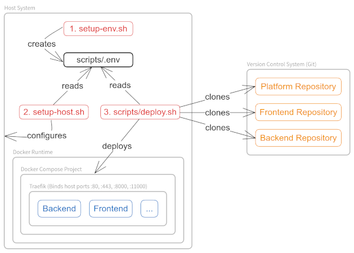

# Agri-Gaia Platform Deployment

## Overview



## Prerequisites

### Install Deploy Keys

**Note**: This step is only required if you're not using the [public GitHub repositories](https://github.com/hsos-ai-lab) of the Agri-Gaia project.

From a remote machine with the GitLab and GitHub deploy keys already in use, copy the required SSH keys to the new platform host:

```bash
scp -i ~/.ssh/agri-gaia-keypair/id_ed25519 -r \
  root@remote:/root/.ssh/agri-gaia \
  root@host:/root/.ssh
```

You should see the following directories with public and private keys inside root's `/root/.ssh` directory:

```text
/root/.ssh/agri-gaia
├── backend
│   ├── id_ed25519
│   └── id_ed25519.pub
├── frontend
│   ├── id_ed25519
│   └── id_ed25519.pub
└── platform
    ├── id_ed25519
    └── id_ed25519.pub
```

### Clone this Repository

Clone the contents of this repository into `/opt/agri-gaia/deploy`:

```bash
AG_SOURCE_DIR=/opt/agri-gaia \
  ; mkdir -p "${AG_SOURCE_DIR}" \
  && cd "${AG_SOURCE_DIR}" \
  && git clone https://github.com/hsos-ai-lab/agri-gaia-platform-deployment.git deploy \
  && cd deploy
```

**Warning**: If you've forked this project into a private repository and want to [manage multiple instances](#managing-multiple-instances), you'll have to clone the private repositroy using SSH and a deploy key. This is necessary to avoid `git pull` to hang while fetching updates to this repository on a remote host due to password authentication.

## Create Deployment Configuration

Run the following command to create a deployment specific `.env` file by answering the prompts presented to you:

```bash
./setup-env.sh
```

Also take a look at the [example `.env`](scripts/.env.example) file.

### Setup the Host

Run the following command to install Docker and various other utility programs needed for deployment:

```bash
./setup-host.sh
```

This script will also install the NVIDIA Contaier Toolkit if a compatible GPU is detected.

## Place Secrets

The Agri-Gaia platform needs files that contain secrets such as the `keystore.jks` for the EDC (Eclipse Dataspace Connector). Create the directory

```text
/opt/agri-gaia/secrets
```

and place the secrets files that are described in the platform repository in this directory. The deployment process will find them there and include them into the platform.

**Optional**: If you plan to use already issued wildcard TLS certificates (`AG_SSL_MODE=issued`) and don't want to create your own private fork of the `agri-gaia-platform` repository, create the subdirectory `/opt/agri-gaia/secrets/certs/issued` and place your `.crt` und `.key` files into that directory. The filenames can be arbitrary, as the deployment process will read the `AG_PROJECT_BASE_URL` from your custom deployment `.env` file.

At this point in time the `AG_SOURCE_DIR` should contain the following three directories with `secrets/certs/*` being optional (see above):

```text
/opt/agri-gaia/
├── deploy
└── secrets
    └── certs
        └── issued
```

## Run `deploy.sh`

Deploy the Agri-Gaia platfrom with the confguration from your `.env` file using the following command:

```bash
# Usage: ./deploy.sh [<AG_GIT_BRANCH_PLATFROM>] [<AG_VOLUMES_TO_REMOVE>]
./deploy.sh
```

This command will execute `./scripts/deploy.sh` with two optional parameters acting as overrides for `AG_GIT_BRANCH_PLATFORM` and `AG_VOLUMES_TO_REMOVE` inside a `screen` session named `<id>.ag-deploy`. You can attach your terminal to that screen session by running the following command:

```bash
screen -r <id>

# or if only one screen session is running
screen -r
```

To list all active screen sessions use `screen -ls`. To detach from a screen session hit `Ctrl+A` follwed by `D`.

## Managing Multiple Instances

If multiple instances of the Agri-Gaia platform are running on different hosts, redeployment of the platform can be automated:

1. For each instance, add the following JSON object to the root object in `instances.json`:

    ```json
    {
      "<name>": {
        "host": "<AG_PROJECT_BASE_URL of instance>",
        "ip": "<host ip>",
        "port": <SSH port of host>,
        "user": "<SSH user on host>"
      }
    }
    ```

2. Make sure your local user can access each host via the _same_ keypair using `ssh`. You might have installed that keypair in `~/.ssh/agri-gaia-keypair` or a different subdirectory.

3. For private deployment repo only: Make sure the remote host can pull from the Platform Deployment's private git repository via SSH. To achieve this, register the SSH public key of the platform repository as a deploy key of the Platform Deployment's repository. After that, add the following to the _remote host's_ `/root/.ssh/config` file:

    ```bash
    set -a
    source scripts/.env
    cat >> /root/.ssh/config <<EOL
    Host agri-gaia-platform-deployment.${AG_GIT_BASE_URL}
          HostName ${AG_GIT_BASE_URL}
          User git
          IdentityFile /root/.ssh/agri-gaia/platform/id_ed25519
          IdentitiesOnly yes
    EOL
    set +a
    ```

4. Run the re-deploy script with your local (non-privileged) user:

    ```bash
    ./redeploy-instances.sh \
      -b <git_branch> \
      [-f <instances_file>] \
      [-t <targets>] \
      [-v <volumes_to_remove>] \
      [-i <identity_file>]
    ```

    * If you would like to re-deploy only a subset of instances from `instances.json`, use the `-t` option and specify a **comma separated** list of instance names without spaces.
    * If you would like to remove Docker Volumes on the remote before re-deploying, use the `-v` option and specify a **comma separated** list of volume names without spaces as shown by `docker volume ls`.

    The following code snipped illustrates the usage of `redeploy-instances.sh` by re-deploying the platform on `dev` and `testing` instances from the `development` branch while removing the `agri_gaia_model-training` and `agri_gaia_cvat-logs` volumes:

    ```bash
    ./redeploy-instances.sh \
      -b development \
      -f instances.json \
      -t dev,testing \
      -v agri_gaia_model-training,agri_gaia_cvat-logs \
      -i ~/.ssh/agri-gaia/platform/id_ed25519
    ```

    Please note that the identity file specified by `-i` is used to connect from you local machine to the host system you want to deploy the platform to.
